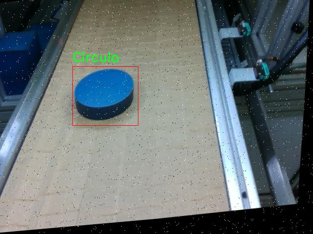

# 改进yolo11-aux等200+全套创新点大全：几何形状检测系统源码＆数据集全套

### 1.图片效果展示


##### 项目来源 **[人工智能促进会 2024.10.22](https://kdocs.cn/l/cszuIiCKVNis)**

##### 注意：由于项目一直在更新迭代，上面“1.图片效果展示”和“2.视频效果展示”展示的系统图片或者视频可能为老版本，新版本在老版本的基础上升级如下：（实际效果以升级的新版本为准）

  （1）适配了YOLOV11的“目标检测”模型和“实例分割”模型，通过加载相应的权重（.pt）文件即可自适应加载模型。

  （2）支持“图片识别”、“视频识别”、“摄像头实时识别”三种识别模式。

  （3）支持“图片识别”、“视频识别”、“摄像头实时识别”三种识别结果保存导出，解决手动导出（容易卡顿出现爆内存）存在的问题，识别完自动保存结果并导出到tempDir中。

  （4）支持Web前端系统中的标题、背景图等自定义修改。

  另外本项目提供训练的数据集和训练教程,暂不提供权重文件（best.pt）,需要您按照教程进行训练后实现图片演示和Web前端界面演示的效果。

### 2.视频效果展示

[2.1 视频效果展示](https://www.bilibili.com/video/BV1qTyoY6E2Y/)

### 3.背景

研究背景与意义

随着计算机视觉技术的快速发展，物体检测已成为人工智能领域的重要研究方向之一。尤其是在工业自动化、智能监控、无人驾驶等应用场景中，准确、快速地识别和分类物体的能力显得尤为重要。YOLO（You Only Look Once）系列模型因其高效的实时检测能力而受到广泛关注。近年来，YOLOv11作为该系列的最新版本，通过改进网络结构和算法，进一步提升了检测精度和速度。然而，针对特定几何形状的检测任务，现有模型在特征提取和分类精度上仍存在一定的局限性。

本研究旨在基于改进的YOLOv11模型，构建一个专门针对几何形状的检测系统。我们所使用的数据集包含3400张图像，涵盖了四种基本几何形状：圆形（Circulo）、正方形（Quadrado）、矩形（Retangulo）和三角形（Triangulo）。该数据集的单一类别设置，使得模型能够集中学习几何形状的特征，从而提高检测的准确性和效率。此外，几何形状的简单性和多样性为模型的训练提供了良好的基础，能够有效避免复杂背景对检测结果的干扰。

通过对YOLOv11模型的改进，我们期望在几何形状检测任务中实现更高的准确率和更快的处理速度。这不仅能够为相关领域的应用提供技术支持，还将推动物体检测技术在特定场景下的深入研究。随着几何形状检测系统的成功实现，我们相信其在教育、建筑、制造等行业的潜在应用将极大地促进相关领域的智能化进程，具有重要的理论价值和实际意义。

### 4.数据集信息展示

##### 4.1 本项目数据集详细数据（类别数＆类别名）

nc: 3
names: ['Circulo', 'Quadrado', 'Retangulo']


该项目为【目标检测】数据集，请在【训练教程和Web端加载模型教程（第三步）】这一步的时候按照【目标检测】部分的教程来训练

##### 4.2 本项目数据集信息介绍

本项目数据集信息介绍

本项目所使用的数据集名为“aline”，旨在为改进YOLOv11的几何形状检测系统提供高质量的训练数据。该数据集包含三种几何形状类别，分别为“Circulo”（圆形）、“Quadrado”（正方形）和“Retangulo”（矩形），总类别数量为三。这些类别的选择不仅涵盖了基本的几何形状，也为算法的训练提供了多样性和挑战性，使得模型能够更好地识别和区分不同形状。

“aline”数据集的构建过程经过精心设计，确保了数据的多样性和代表性。每种几何形状在数据集中都有大量的样本，以便模型能够学习到形状的不同特征和变体。数据集中包含了各种角度、大小和背景的图像，这些因素都是影响形状识别准确性的关键。通过这种方式，数据集不仅提供了理想的训练条件，还能有效地提高模型在实际应用中的鲁棒性。

此外，数据集中的图像经过标注，确保每个样本的几何形状都被准确地框定和分类。这种精确的标注对于训练深度学习模型至关重要，因为它直接影响到模型的学习效果和最终的检测性能。通过使用“aline”数据集，研究人员能够在YOLOv11的基础上进行改进，提升其在几何形状检测任务中的表现。

总之，“aline”数据集为本项目提供了一个坚实的基础，支持了YOLOv11模型在几何形状检测领域的进一步研究与发展。通过对该数据集的深入分析和应用，期望能够推动形状识别技术的进步，并为相关领域的应用提供更为准确和高效的解决方案。




### 5.全套项目环境部署视频教程（零基础手把手教学）

[5.1 所需软件PyCharm和Anaconda安装教程（第一步）](https://www.bilibili.com/video/BV1BoC1YCEKi/?spm_id_from=333.999.0.0&vd_source=bc9aec86d164b67a7004b996143742dc)


[5.2 安装Python虚拟环境创建和依赖库安装视频教程（第二步）](https://www.bilibili.com/video/BV1ZoC1YCEBw?spm_id_from=333.788.videopod.sections&vd_source=bc9aec86d164b67a7004b996143742dc)

### 6.改进YOLOv11训练教程和Web_UI前端加载模型教程（零基础手把手教学）

[6.1 改进YOLOv11训练教程和Web_UI前端加载模型教程（第三步）](https://www.bilibili.com/video/BV1BoC1YCEhR?spm_id_from=333.788.videopod.sections&vd_source=bc9aec86d164b67a7004b996143742dc)


按照上面的训练视频教程链接加载项目提供的数据集，运行train.py即可开始训练



     Epoch   gpu_mem       box       obj       cls    labels  img_size
     1/200     20.8G   0.01576   0.01955  0.007536        22      1280: 100%|██████████| 849/849 [14:42<00:00,  1.04s/it]
               Class     Images     Labels          P          R     mAP@.5 mAP@.5:.95: 100%|██████████| 213/213 [01:14<00:00,  2.87it/s]
                 all       3395      17314      0.994      0.957      0.0957      0.0843

     Epoch   gpu_mem       box       obj       cls    labels  img_size
     2/200     20.8G   0.01578   0.01923  0.007006        22      1280: 100%|██████████| 849/849 [14:44<00:00,  1.04s/it]
               Class     Images     Labels          P          R     mAP@.5 mAP@.5:.95: 100%|██████████| 213/213 [01:12<00:00,  2.95it/s]
                 all       3395      17314      0.996      0.956      0.0957      0.0845

     Epoch   gpu_mem       box       obj       cls    labels  img_size
     3/200     20.8G   0.01561    0.0191  0.006895        27      1280: 100%|██████████| 849/849 [10:56<00:00,  1.29it/s]
               Class     Images     Labels          P          R     mAP@.5 mAP@.5:.95: 100%|███████   | 187/213 [00:52<00:00,  4.04it/s]
                 all       3395      17314      0.996      0.957      0.0957      0.0845


###### [项目数据集下载链接](https://kdocs.cn/l/cszuIiCKVNis)

### 7.原始YOLOv11算法讲解

##### YOLO11简介

> YOLO11源码地址：https://github.com/ultralytics/ultralytics

Ultralytics
YOLO11是一款尖端的、最先进的模型，它在之前YOLO版本成功的基础上进行了构建，并引入了新功能和改进，以进一步提升性能和灵活性。YOLO11设计快速、准确且易于使用，使其成为各种物体检测和跟踪、实例分割、图像分类以及姿态估计任务的绝佳选择。  


**YOLO11创新点如下:**

YOLO 11主要改进包括：  
`增强的特征提取`：YOLO 11采用了改进的骨干和颈部架构，增强了特征提取功能，以实现更精确的目标检测。  
`优化的效率和速度`：优化的架构设计和优化的训练管道提供更快的处理速度，同时保持准确性和性能之间的平衡。  
`更高的精度，更少的参数`：YOLO11m在COCO数据集上实现了更高的平均精度（mAP），参数比YOLOv8m少22%，使其在不影响精度的情况下提高了计算效率。  
`跨环境的适应性`：YOLO 11可以部署在各种环境中，包括边缘设备、云平台和支持NVIDIA GPU的系统。  
`广泛的支持任务`：YOLO 11支持各种计算机视觉任务，如对象检测、实例分割、图像分类、姿态估计和面向对象检测（OBB）。

**YOLO11不同模型尺寸信息：**

YOLO11 提供5种不同的型号规模模型，以满足不同的应用需求：

Model| size (pixels)| mAPval 50-95| Speed CPU ONNX (ms)| Speed T4 TensorRT10
(ms)| params (M)| FLOPs (B)  
---|---|---|---|---|---|---  
YOLO11n| 640| 39.5| 56.1 ± 0.8| 1.5 ± 0.0| 2.6| 6.5  
YOLO11s| 640| 47.0| 90.0 ± 1.2| 2.5 ± 0.0| 9.4| 21.5  
YOLO11m| 640| 51.5| 183.2 ± 2.0| 4.7 ± 0.1| 20.1| 68.0  
YOLO11l| 640| 53.4| 238.6 ± 1.4| 6.2 ± 0.1| 25.3| 86.9  
YOLO11x| 640| 54.7| 462.8 ± 6.7| 11.3 ± 0.2| 56.9| 194.9  
  
**模型常用训练超参数参数说明：**  
`YOLOv11
模型的训练设置包括训练过程中使用的各种超参数和配置`。这些设置会影响模型的性能、速度和准确性。关键的训练设置包括批量大小、学习率、动量和权重衰减。此外，优化器、损失函数和训练数据集组成的选择也会影响训练过程。对这些设置进行仔细的调整和实验对于优化性能至关重要。  
**以下是一些常用的模型训练参数和说明：**

参数名| 默认值| 说明  
---|---|---  
`model`| `None`| 指定用于训练的模型文件。接受指向 `.pt` 预训练模型或 `.yaml`
配置文件。对于定义模型结构或初始化权重至关重要。  
`data`| `None`| 数据集配置文件的路径（例如
`coco8.yaml`).该文件包含特定于数据集的参数，包括训练数据和验证数据的路径、类名和类数。  
`epochs`| `100`| 训练总轮数。每个epoch代表对整个数据集进行一次完整的训练。调整该值会影响训练时间和模型性能。  
`patience`| `100`| 在验证指标没有改善的情况下，提前停止训练所需的epoch数。当性能趋于平稳时停止训练，有助于防止过度拟合。  
`batch`| `16`| 批量大小，有三种模式:设置为整数(例如，’ Batch =16 ‘)， 60% GPU内存利用率的自动模式(’ Batch
=-1 ‘)，或指定利用率分数的自动模式(’ Batch =0.70 ')。  
`imgsz`| `640`| 用于训练的目标图像尺寸。所有图像在输入模型前都会被调整到这一尺寸。影响模型精度和计算复杂度。  
`device`| `None`| 指定用于训练的计算设备：单个 GPU (`device=0`）、多个 GPU (`device=0,1`)、CPU
(`device=cpu`)，或苹果芯片的 MPS (`device=mps`).  
`workers`| `8`| 加载数据的工作线程数（每 `RANK` 多 GPU 训练）。影响数据预处理和输入模型的速度，尤其适用于多 GPU 设置。  
`name`| `None`| 训练运行的名称。用于在项目文件夹内创建一个子目录，用于存储训练日志和输出结果。  
`pretrained`| `True`| 决定是否从预处理模型开始训练。可以是布尔值，也可以是加载权重的特定模型的字符串路径。提高训练效率和模型性能。  
`optimizer`| `'auto'`| 为训练模型选择优化器。选项包括 `SGD`, `Adam`, `AdamW`, `NAdam`,
`RAdam`, `RMSProp` 等，或 `auto` 用于根据模型配置进行自动选择。影响收敛速度和稳定性  
`lr0`| `0.01`| 初始学习率（即 `SGD=1E-2`, `Adam=1E-3`) .调整这个值对优化过程至关重要，会影响模型权重的更新速度。  
`lrf`| `0.01`| 最终学习率占初始学习率的百分比 = (`lr0 * lrf`)，与调度程序结合使用，随着时间的推移调整学习率。  


**各损失函数作用说明：**  
`定位损失box_loss`：预测框与标定框之间的误差（GIoU），越小定位得越准；  
`分类损失cls_loss`：计算锚框与对应的标定分类是否正确，越小分类得越准；  
`动态特征损失（dfl_loss）`：DFLLoss是一种用于回归预测框与目标框之间距离的损失函数。在计算损失时，目标框需要缩放到特征图尺度，即除以相应的stride，并与预测的边界框计算Ciou
Loss，同时与预测的anchors中心点到各边的距离计算回归DFLLoss。  


### 8.200+种全套改进YOLOV11创新点原理讲解

#### 8.1 200+种全套改进YOLOV11创新点原理讲解大全

由于篇幅限制，每个创新点的具体原理讲解就不全部展开，具体见下列网址中的改进模块对应项目的技术原理博客网址【Blog】（创新点均为模块化搭建，原理适配YOLOv5~YOLOv11等各种版本）

[改进模块技术原理博客【Blog】网址链接](https://gitee.com/qunmasj/good)


#### 8.2 精选部分改进YOLOV11创新点原理讲解

###### 这里节选部分改进创新点展开原理讲解(完整的改进原理见上图和[改进模块技术原理博客链接](https://gitee.com/qunmasj/good)【如果此小节的图加载失败可以通过CSDN或者Github搜索该博客的标题访问原始博客，原始博客图片显示正常】
### 可变性卷积DCN简介
卷积神经网络由于其构建模块中固定的几何结构，本质上受限于模型几何变换。为了提高卷积神经网络的转换建模能力，《Deformable Convolutional Networks》作者提出了两个模块：可变形卷积（deformable convolution）和可变形RoI池（deformable RoI pooling）。这两个模块均基于用额外的偏移来增加模块中的空间采样位置以及从目标任务中学习偏移的思想，而不需要额外的监督。

第一次证明了在深度神经网络中学习密集空间变换（dense spatial transformation）对于复杂的视觉任务是有效的

视觉识别中的一个关键挑战是如何适应对象比例、姿态、视点和零件变形中的几何变化或模型几何变换。一般有两种方法实现：
1）建立具有足够期望变化的训练数据集。这通常通过增加现有的数据样本来实现，例如通过仿射变换。但是训练成本昂贵而且模型参数庞大。
2）使用变换不变（transformation-invariant）的特征和算法。比如比较有名的SIFT(尺度不变特征变换)便是这一类的代表算法。

但以上的方法有两个缺点：
1）几何变换被假定为固定的和已知的，这些先验知识被用来扩充数据，设计特征和算法。为此，这个假设阻止了对具有未知几何变换的新任务的推广，从而导致这些几何变换可能没有被正确建模。
2）对于不变特征和算法进行手动设计，对于过于复杂的变换可能是困难的或不可行的。

卷积神经网络本质上局限于模拟大型未知转换。局限性源于CNN模块的固定几何结构：卷积单元在固定位置对输入特征图进行采样；池化层以固定比率降低特征矩阵分辨率；RoI（感兴趣区域）池化层将RoI分成固定的空间箱（spatial bins）等。缺乏处理几何变换的内部机制。

这种内部机制的缺乏会导致一些问题，举个例子。同一个CNN层中所有激活单元的感受野大小是相同的，但是这是不可取的。因为不同的位置可能对应于具有不同尺度或变形的对象，所以尺度或感受野大小的自适应确定对于具有精细定位的视觉识别是渴望的。

对于这些问题，作者提出了两个模块提高CNNs对几何变换建模的能力。


deformable convolution（可变形卷积）
将2D偏移量添加到标准卷积中的常规网格采样位置，使得采样网格能够自由变形。通过额外的卷积层，从前面的特征映射中学习偏移。因此，变形采用局部、密集和自适应的方式取决于输入特征。


deformable RoI pooling（可变形RoI池化）
为先前RoI池化的常规库（bin）分区中的每个库位置（bin partition）增加了一个偏移量。类似地，偏移是从前面的特征图和感兴趣区域中学习的，从而能够对具有不同形状的对象进行自适应部件定位（adaptive part localization）。

#### Deformable Convolutional Networks
Deformable Convolution
2D卷积由两个步骤组成：
1）在输入特征图x xx上使用规则网格R RR进行采样。
2）把这些采样点乘不同权重w ww后相加。

网格R定义感受野大小和扩张程度，比如内核大小为3x3，扩张程度为1的网格R可以表示为：
R = { ( − 1 , − 1 ) , ( − 1 , 0 ) , … , ( 0 , 1 ) , ( 1 , 1 ) } R = \{(-1,-1),(-1,0),\dots,(0,1),(1,1)\}
R={(−1,−1),(−1,0),…,(0,1),(1,1)}

​
 一般为小数，使用双线性插值进行处理。（把小数坐标分解到相邻的四个整数坐标点来计算结果）


具体操作如图所示：


首先对输入特征层进行一个普通的3x3卷积处理得到偏移域（offset field）。偏移域特征图具有与输入特征图相同的空间分辨率，channels维度2N对应于N个2D（xy两个方向）偏移。其中的N是原输入特征图上所具有的N个channels，也就是输入输出channels保持不变，这里xy两个channels分别对输出特征图上的一个channels进行偏移。确定采样点后就通过与相对应的权重w点乘相加得到输出特征图上该点最终值。

前面也提到过，由于这里xy两个方向所训练出来的偏移量一般来说是一个小数，那么为了得到这个点所对应的数值，会采用双线性插值的方法，从最近的四个邻近坐标点中计算得到该偏移点的数值，公式如下：


具体推理过程见：双线性插值原理

#### Deformable RoI Poolingb
所有基于区域提议（RPN）的对象检测方法都使用RoI池话处理，将任意大小的输入矩形区域转换为固定大小的特征图。


 一般为小数，需要使用双线性插值进行处理。


具体操作如图所示：


当时看这个部分的时候觉得有些突兀，明明RoI池化会将特征层转化为固定尺寸的区域。其实，我个人觉得，这个部分与上述的可变性卷积操作是类似的。这里同样是使用了一个普通的RoI池化操作，进行一些列处理后得到了一个偏移域特征图，然后重新作用于原来的w × H w \times Hw×H的RoI。只不过这里不再是规律的逐行逐列对每个格子进行池化，而是对于格子进行偏移后再池化处理。

#### Postion﹣Sensitive RoI Pooling
除此之外，论文还提出一种PS RoI池化（Postion﹣Sensitive RoI Pooling）。不同于上述可变形RoI池化中的全连接过程，这里使用全卷积替换。

具体操作如图所示：


首先，对于原来的特征图来说，原本是将输入特征图上的RoI区域分成k × k k\times kk×k个bin。而在这里，则是将输入特征图进行卷积操作，分别得到一个channels为k 2 ( C + 1 ) k^{2}(C+1)k (C+1)的得分图（score maps）和一个channels为2 k 2 ( C + 1 ) 2k{2}(C+1)2k 2 (C+1)的偏移域（offset fields），这两个特征矩阵的宽高是与输入特征矩阵相同的。其中，得分图的channels中，k × k k \times kk×k分别表示的是每一个网格，C CC表示的检测对象的类别数目，1表示背景。而在偏移域中的2表示xy两个方向的偏移。
也就是说，在PS RoI池化中，对于RoI的每一个网格都独自占一个通道形成一层得分图，然后其对于的偏移量占两个通道。offset fields得到的偏移是归一化后的偏移，需要通过和deformable RoI pooling中一样的变换方式得到∆ p i j ∆p_{ij}∆p ij，然后对每层得分图进行偏移池化处理。最后处理完的结果就对应着最后输出的一个网格。所以其包含了位置信息。

原文论述为：


#### Understanding Deformable ConvNets
当可变形卷积叠加时，复合变形的效果是深远的。如图所示：


ps：a是标准卷积的固定感受野，b是可变形卷积的适应性感受野。

感受野和标准卷积中的采样位置在整个顶部特征图上是固定的(左)。在可变形卷积中，它们根据对象的比例和形状进行自适应调整(右)。


### 9.系统功能展示

图9.1.系统支持检测结果表格显示

  图9.2.系统支持置信度和IOU阈值手动调节

  图9.3.系统支持自定义加载权重文件best.pt(需要你通过步骤5中训练获得)

  图9.4.系统支持摄像头实时识别

  图9.5.系统支持图片识别

  图9.6.系统支持视频识别

  图9.7.系统支持识别结果文件自动保存

  图9.8.系统支持Excel导出检测结果数据


### 10. YOLOv11核心改进源码讲解

#### 10.1 test_selective_scan_easy.py

以下是对代码中最核心部分的分析和详细注释：

```python
import torch
import torch.nn.functional as F

def selective_scan_easy(us, dts, As, Bs, Cs, Ds, delta_bias=None, delta_softplus=False, return_last_state=False, chunksize=64):
    """
    选择性扫描函数，进行序列数据的处理。
    
    参数：
    us: 输入数据，形状为 (B, G * D, L)
    dts: 时间增量，形状为 (B, G * D, L)
    As: 权重矩阵，形状为 (G * D, N)
    Bs: 权重矩阵，形状为 (B, G, N, L)
    Cs: 权重矩阵，形状为 (B, G, N, L)
    Ds: 可选的偏置项，形状为 (G * D)
    delta_bias: 可选的偏置增量，形状为 (G * D)
    delta_softplus: 是否使用softplus激活函数
    return_last_state: 是否返回最后的状态
    chunksize: 每次处理的序列长度
    """
    
    def selective_scan_chunk(us, dts, As, Bs, Cs, hprefix):
        """
        处理单个块的选择性扫描。
        
        参数：
        us: 输入数据块，形状为 (L, B, G, D)
        dts: 时间增量块，形状为 (L, B, G, D)
        As: 权重矩阵，形状为 (G, D, N)
        Bs: 权重矩阵，形状为 (L, B, G, N)
        Cs: 权重矩阵，形状为 (L, B, G, N)
        hprefix: 前一个状态，形状为 (B, G, D, N)
        
        返回：
        ys: 输出结果，形状为 (L, B, G, D)
        hs: 状态，形状为 (L, B, G, D, N)
        """
        ts = dts.cumsum(dim=0)  # 计算时间增量的累积和
        Ats = torch.einsum("gdn,lbgd->lbgdn", As, ts).exp()  # 计算A的指数
        scale = 1  # 缩放因子
        rAts = Ats / scale  # 归一化
        duts = dts * us  # 计算增量
        dtBus = torch.einsum("lbgd,lbgn->lbgdn", duts, Bs)  # 计算B的增量
        hs_tmp = rAts * (dtBus / rAts).cumsum(dim=0)  # 计算状态
        hs = hs_tmp + Ats * hprefix.unsqueeze(0)  # 更新状态
        ys = torch.einsum("lbgn,lbgdn->lbgd", Cs, hs)  # 计算输出
        return ys, hs

    # 数据类型设置
    dtype = torch.float32
    inp_dtype = us.dtype  # 输入数据类型
    has_D = Ds is not None  # 检查Ds是否存在
    if chunksize < 1:
        chunksize = Bs.shape[-1]  # 设置块大小

    # 处理输入数据
    dts = dts.to(dtype)
    if delta_bias is not None:
        dts = dts + delta_bias.view(1, -1, 1).to(dtype)  # 添加偏置
    if delta_softplus:
        dts = F.softplus(dts)  # 应用softplus激活函数

    # 调整输入数据的形状
    Bs = Bs.unsqueeze(1) if len(Bs.shape) == 3 else Bs
    Cs = Cs.unsqueeze(1) if len(Cs.shape) == 3 else Cs
    B, G, N, L = Bs.shape
    us = us.view(B, G, -1, L).permute(3, 0, 1, 2).to(dtype)
    dts = dts.view(B, G, -1, L).permute(3, 0, 1, 2).to(dtype)
    As = As.view(G, -1, N).to(dtype)
    Bs = Bs.permute(3, 0, 1, 2).to(dtype)
    Cs = Cs.permute(3, 0, 1, 2).to(dtype)
    Ds = Ds.view(G, -1).to(dtype) if has_D else None
    D = As.shape[1]  # 获取状态维度

    oys = []  # 输出结果列表
    hprefix = us.new_zeros((B, G, D, N), dtype=dtype)  # 初始化前一个状态
    for i in range(0, L, chunksize):
        ys, hs = selective_scan_chunk(
            us[i:i + chunksize], dts[i:i + chunksize], 
            As, Bs[i:i + chunksize], Cs[i:i + chunksize], hprefix, 
        )
        oys.append(ys)  # 添加输出结果
        hprefix = hs[-1]  # 更新前一个状态

    oys = torch.cat(oys, dim=0)  # 合并输出结果
    if has_D:
        oys = oys + Ds * us  # 添加偏置项
    oys = oys.permute(1, 2, 3, 0).view(B, -1, L)  # 调整输出形状

    return oys.to(inp_dtype) if not return_last_state else (oys.to(inp_dtype), hprefix.view(B, G * D, N).float())
```

### 代码核心部分说明：
1. **函数定义**：`selective_scan_easy` 是一个选择性扫描的核心函数，处理输入数据和时间增量，并计算输出。
2. **内部函数**：`selective_scan_chunk` 是一个处理单个数据块的函数，计算状态和输出。
3. **输入处理**：对输入数据进行形状调整和类型转换，确保后续计算的正确性。
4. **循环处理**：通过循环处理每个数据块，逐步更新状态和输出结果。
5. **返回值**：根据参数选择返回输出结果或最后状态。

这段代码实现了一个复杂的序列处理逻辑，使用了张量运算和自动微分功能，适合用于深度学习模型中的序列数据处理。

这个文件 `test_selective_scan_easy.py` 是一个用于测试选择性扫描（Selective Scan）算法的实现。该算法主要用于处理序列数据，常见于时间序列分析和递归神经网络等领域。代码中包含了多个函数和类的定义，以及一些测试用例，以下是对代码的逐步分析和说明。

首先，文件引入了一些必要的库，包括 `math`、`functools`、`torch`、`torch.nn.functional`、`pytest` 和 `einops`。这些库提供了数学运算、函数式编程、深度学习操作、测试框架和张量重排等功能。

接下来，定义了一个名为 `selective_scan_easy` 的函数，它实现了选择性扫描的核心逻辑。该函数接受多个参数，包括输入张量 `us` 和 `dts`，以及权重矩阵 `As`、`Bs`、`Cs` 和 `Ds`。函数内部定义了一个嵌套函数 `selective_scan_chunk`，用于处理输入数据的一个块（chunk）。这个嵌套函数通过对输入数据进行累积和变换，计算出输出张量 `ys` 和隐藏状态 `hs`。

在 `selective_scan_easy` 函数中，首先对输入数据进行类型转换和形状调整，以确保它们符合预期的格式。然后，使用循环将输入数据分块处理，调用 `selective_scan_chunk` 函数，并将结果存储在列表中。最后，将所有块的结果拼接在一起，返回最终的输出。

随后，定义了一个名为 `SelectiveScanEasy` 的类，它继承自 `torch.autograd.Function`，用于实现自定义的前向和反向传播。该类的 `forward` 方法实现了选择性扫描的前向计算，`backward` 方法实现了反向传播的梯度计算。通过使用 `torch.cuda.amp.custom_fwd` 和 `torch.cuda.amp.custom_bwd` 装饰器，确保在混合精度训练时的性能优化。

在 `selective_scan_easy_fwdbwd` 函数中，封装了对 `SelectiveScanEasy` 类的调用，以便在需要时可以方便地进行前向和反向传播的计算。

接下来，定义了多个版本的选择性扫描函数，如 `selective_scan_easyv2` 和 `selective_scan_easyv3`，这些版本可能在实现细节上有所不同，旨在优化性能或适应不同的使用场景。

文件的最后部分包含了一个名为 `test_selective_scan` 的测试函数，它使用 `pytest` 框架进行单元测试。通过参数化的方式，测试函数可以验证不同输入条件下选择性扫描函数的正确性和性能。测试过程中，首先生成随机输入数据，然后调用选择性扫描函数和参考实现，比较它们的输出和梯度，确保它们在数值上足够接近。

总体而言，这个文件实现了选择性扫描算法的核心逻辑，并通过测试确保其正确性和性能。选择性扫描在处理序列数据时非常有用，尤其是在需要高效计算累积和的场景中。

#### 10.2 afpn.py

以下是经过简化并添加详细中文注释的核心代码部分：

```python
import torch
import torch.nn as nn
import torch.nn.functional as F
from ..modules.conv import Conv

# 定义基本的卷积块
class BasicBlock(nn.Module):
    def __init__(self, filter_in, filter_out):
        super(BasicBlock, self).__init__()
        # 定义两个卷积层
        self.conv1 = Conv(filter_in, filter_out, 3)  # 第一个卷积层
        self.conv2 = Conv(filter_out, filter_out, 3, act=False)  # 第二个卷积层，不使用激活函数

    def forward(self, x):
        residual = x  # 保存输入以便后续残差连接
        out = self.conv1(x)  # 通过第一个卷积层
        out = self.conv2(out)  # 通过第二个卷积层
        out += residual  # 添加残差
        return self.conv1.act(out)  # 返回激活后的输出

# 定义上采样模块
class Upsample(nn.Module):
    def __init__(self, in_channels, out_channels, scale_factor=2):
        super(Upsample, self).__init__()
        # 定义上采样的卷积层和上采样操作
        self.upsample = nn.Sequential(
            Conv(in_channels, out_channels, 1),  # 1x1卷积
            nn.Upsample(scale_factor=scale_factor, mode='bilinear')  # 双线性插值上采样
        )

    def forward(self, x):
        return self.upsample(x)  # 直接返回上采样结果

# 定义下采样模块（2倍）
class Downsample_x2(nn.Module):
    def __init__(self, in_channels, out_channels):
        super(Downsample_x2, self).__init__()
        # 定义2倍下采样的卷积层
        self.downsample = Conv(in_channels, out_channels, 2, 2, 0)

    def forward(self, x):
        return self.downsample(x)  # 直接返回下采样结果

# 定义自适应特征融合模块（ASFF）
class ASFF_2(nn.Module):
    def __init__(self, inter_dim=512):
        super(ASFF_2, self).__init__()
        self.inter_dim = inter_dim
        compress_c = 8  # 压缩通道数

        # 定义权重卷积层
        self.weight_level_1 = Conv(self.inter_dim, compress_c, 1)
        self.weight_level_2 = Conv(self.inter_dim, compress_c, 1)
        self.weight_levels = nn.Conv2d(compress_c * 2, 2, kernel_size=1, stride=1, padding=0)
        self.conv = Conv(self.inter_dim, self.inter_dim, 3)  # 融合后的卷积层

    def forward(self, input1, input2):
        # 计算每个输入的权重
        level_1_weight_v = self.weight_level_1(input1)
        level_2_weight_v = self.weight_level_2(input2)

        # 合并权重并计算softmax
        levels_weight_v = torch.cat((level_1_weight_v, level_2_weight_v), 1)
        levels_weight = self.weight_levels(levels_weight_v)
        levels_weight = F.softmax(levels_weight, dim=1)

        # 进行特征融合
        fused_out_reduced = input1 * levels_weight[:, 0:1, :, :] + \
                            input2 * levels_weight[:, 1:2, :, :]

        out = self.conv(fused_out_reduced)  # 通过卷积层
        return out  # 返回融合后的输出

# 定义特征金字塔网络（AFPN）
class AFPN_P345(nn.Module):
    def __init__(self, in_channels=[256, 512, 1024], out_channels=256, factor=4):
        super(AFPN_P345, self).__init__()
        # 定义输入通道到输出通道的卷积层
        self.conv0 = Conv(in_channels[0], in_channels[0] // factor, 1)
        self.conv1 = Conv(in_channels[1], in_channels[1] // factor, 1)
        self.conv2 = Conv(in_channels[2], in_channels[2] // factor, 1)

        # 定义特征块
        self.body = BlockBody_P345([in_channels[0] // factor, in_channels[1] // factor, in_channels[2] // factor])

        # 定义输出卷积层
        self.conv00 = Conv(in_channels[0] // factor, out_channels, 1)
        self.conv11 = Conv(in_channels[1] // factor, out_channels, 1)
        self.conv22 = Conv(in_channels[2] // factor, out_channels, 1)

    def forward(self, x):
        x0, x1, x2 = x  # 拆分输入
        x0 = self.conv0(x0)  # 通过卷积层
        x1 = self.conv1(x1)
        x2 = self.conv2(x2)

        out0, out1, out2 = self.body([x0, x1, x2])  # 通过特征块
        out0 = self.conv00(out0)  # 输出卷积
        out1 = self.conv11(out1)
        out2 = self.conv22(out2)
        return [out0, out1, out2]  # 返回输出
```

### 代码说明：
1. **BasicBlock**：定义了一个基本的卷积块，包含两个卷积层和残差连接。
2. **Upsample** 和 **Downsample**：定义了上采样和下采样的模块，分别使用卷积和插值方法。
3. **ASFF_2**：实现了自适应特征融合的功能，计算输入特征的权重并进行融合。
4. **AFPN_P345**：构建了特征金字塔网络的基础结构，负责输入特征的处理和输出特征的生成。

以上是核心代码的简化和注释，旨在帮助理解其基本结构和功能。

这个程序文件 `afpn.py` 实现了一个用于图像处理的深度学习模型，主要包括了不同的网络结构和模块，尤其是自适应特征金字塔网络（AFPN）。该文件使用了 PyTorch 框架，定义了一系列的类和方法来构建网络。

首先，文件引入了一些必要的库和模块，包括 `torch` 和 `torch.nn`，以及自定义的卷积和块模块。接着，定义了一些基本的网络块，如 `BasicBlock`、`Upsample`、`Downsample_x2`、`Downsample_x4`、`Downsample_x8` 等，这些模块负责特征图的卷积、上采样和下采样操作。

`BasicBlock` 类是一个基本的残差块，包含两个卷积层和一个残差连接。`Upsample` 和 `Downsample` 类则实现了特征图的上采样和下采样，分别使用了不同的卷积和插值方法。

接下来，定义了多个自适应特征融合模块（ASFF），如 `ASFF_2`、`ASFF_3` 和 `ASFF_4`，这些模块通过计算输入特征图的权重并进行加权融合，以实现不同尺度特征的有效结合。每个 ASFF 模块都包含多个卷积层和一个 softmax 操作，用于生成融合后的特征图。

然后，`BlockBody_P345` 和 `BlockBody_P2345` 类实现了特定的网络结构，这些结构通过组合多个基本块和 ASFF 模块来处理不同尺度的特征图。`BlockBody_P345_Custom` 和 `BlockBody_P2345_Custom` 类则允许用户自定义块类型，以便在不同的应用场景中使用。

`AFPN_P345` 和 `AFPN_P2345` 类是网络的主要实现，分别处理三个和四个输入通道的特征图。它们通过一系列卷积层和自定义的块体来处理输入特征，并最终输出经过处理的特征图。这些类在初始化时还包括了权重初始化的操作，以确保网络在训练开始时具有良好的性能。

最后，`AFPN_P345_Custom` 和 `AFPN_P2345_Custom` 类提供了进一步的自定义选项，允许用户选择不同的块类型来构建网络。

整体而言，这个程序文件实现了一个灵活且可扩展的深度学习模型，适用于图像分割、目标检测等任务，通过自适应特征融合技术来提高模型的性能。

#### 10.3 kan_conv.py

以下是保留的核心代码部分，并添加了详细的中文注释：

```python
import torch
import torch.nn as nn

class KANConvNDLayer(nn.Module):
    def __init__(self, conv_class, norm_class, input_dim, output_dim, spline_order, kernel_size,
                 groups=1, padding=0, stride=1, dilation=1,
                 ndim: int = 2, grid_size=5, base_activation=nn.GELU, grid_range=[-1, 1], dropout=0.0):
        super(KANConvNDLayer, self).__init__()
        
        # 初始化参数
        self.inputdim = input_dim  # 输入维度
        self.outdim = output_dim    # 输出维度
        self.spline_order = spline_order  # 样条阶数
        self.kernel_size = kernel_size  # 卷积核大小
        self.padding = padding  # 填充
        self.stride = stride  # 步幅
        self.dilation = dilation  # 膨胀
        self.groups = groups  # 分组数
        self.ndim = ndim  # 维度
        self.grid_size = grid_size  # 网格大小
        self.base_activation = base_activation()  # 基础激活函数
        self.grid_range = grid_range  # 网格范围

        # 初始化dropout层
        self.dropout = None
        if dropout > 0:
            if ndim == 1:
                self.dropout = nn.Dropout1d(p=dropout)
            elif ndim == 2:
                self.dropout = nn.Dropout2d(p=dropout)
            elif ndim == 3:
                self.dropout = nn.Dropout3d(p=dropout)

        # 检查分组参数的有效性
        if groups <= 0:
            raise ValueError('groups must be a positive integer')
        if input_dim % groups != 0:
            raise ValueError('input_dim must be divisible by groups')
        if output_dim % groups != 0:
            raise ValueError('output_dim must be divisible by groups')

        # 初始化基础卷积层
        self.base_conv = nn.ModuleList([conv_class(input_dim // groups,
                                                   output_dim // groups,
                                                   kernel_size,
                                                   stride,
                                                   padding,
                                                   dilation,
                                                   groups=1,
                                                   bias=False) for _ in range(groups)])

        # 初始化样条卷积层
        self.spline_conv = nn.ModuleList([conv_class((grid_size + spline_order) * input_dim // groups,
                                                     output_dim // groups,
                                                     kernel_size,
                                                     stride,
                                                     padding,
                                                     dilation,
                                                     groups=1,
                                                     bias=False) for _ in range(groups)])

        # 初始化层归一化层
        self.layer_norm = nn.ModuleList([norm_class(output_dim // groups) for _ in range(groups)])

        # 初始化PReLU激活函数
        self.prelus = nn.ModuleList([nn.PReLU() for _ in range(groups)])

        # 生成网格
        h = (self.grid_range[1] - self.grid_range[0]) / grid_size
        self.grid = torch.linspace(
            self.grid_range[0] - h * spline_order,
            self.grid_range[1] + h * spline_order,
            grid_size + 2 * spline_order + 1,
            dtype=torch.float32
        )

        # 使用Kaiming均匀分布初始化卷积层权重
        for conv_layer in self.base_conv:
            nn.init.kaiming_uniform_(conv_layer.weight, nonlinearity='linear')

        for conv_layer in self.spline_conv:
            nn.init.kaiming_uniform_(conv_layer.weight, nonlinearity='linear')

    def forward_kan(self, x, group_index):
        # 处理输入并进行基础卷积
        base_output = self.base_conv[group_index](self.base_activation(x))

        x_uns = x.unsqueeze(-1)  # 扩展维度以进行样条操作
        target = x.shape[1:] + self.grid.shape  # 计算目标形状
        grid = self.grid.view(*list([1 for _ in range(self.ndim + 1)] + [-1, ])).expand(target).contiguous().to(x.device)

        # 计算样条基
        bases = ((x_uns >= grid[..., :-1]) & (x_uns < grid[..., 1:])).to(x.dtype)

        # 计算多阶样条基
        for k in range(1, self.spline_order + 1):
            left_intervals = grid[..., :-(k + 1)]
            right_intervals = grid[..., k:-1]
            delta = torch.where(right_intervals == left_intervals, torch.ones_like(right_intervals),
                                right_intervals - left_intervals)
            bases = ((x_uns - left_intervals) / delta * bases[..., :-1]) + \
                    ((grid[..., k + 1:] - x_uns) / (grid[..., k + 1:] - grid[..., 1:(-k)]) * bases[..., 1:])
        bases = bases.contiguous()
        bases = bases.moveaxis(-1, 2).flatten(1, 2)  # 调整基的形状
        spline_output = self.spline_conv[group_index](bases)  # 进行样条卷积
        x = self.prelus[group_index](self.layer_norm[group_index](base_output + spline_output))  # 归一化和激活

        if self.dropout is not None:
            x = self.dropout(x)  # 应用dropout

        return x

    def forward(self, x):
        # 将输入按组分割
        split_x = torch.split(x, self.inputdim // self.groups, dim=1)
        output = []
        for group_ind, _x in enumerate(split_x):
            y = self.forward_kan(_x.clone(), group_ind)  # 对每个组进行前向传播
            output.append(y.clone())
        y = torch.cat(output, dim=1)  # 合并输出
        return y
```

### 代码说明
1. **KANConvNDLayer类**：这是一个自定义的卷积层，支持多维卷积（1D、2D、3D），并结合了样条基的卷积操作。
2. **初始化方法**：设置卷积层、归一化层、激活函数和dropout等参数，并进行相应的初始化。
3. **forward_kan方法**：实现了具体的前向传播逻辑，包括基础卷积、样条基的计算、样条卷积和激活。
4. **forward方法**：将输入数据按组分割，分别进行前向传播，然后合并输出。

这个程序文件定义了一个名为 `KANConvNDLayer` 的神经网络层，主要用于实现一种新的卷积操作，支持多维输入（如1D、2D、3D）。该层的设计灵感来源于样条插值，结合了卷积操作和归一化层，旨在提高模型的表达能力和训练效果。

在 `KANConvNDLayer` 的构造函数中，首先初始化了一些参数，包括输入和输出维度、样条的阶数、卷积核大小、步幅、填充、扩张率、分组数等。通过这些参数，用户可以灵活地配置卷积层的行为。构造函数还会检查分组数是否为正整数，并确保输入和输出维度可以被分组数整除，以保证每个组的输入和输出维度一致。

接下来，构造函数创建了基础卷积层和样条卷积层的模块列表。基础卷积层使用传入的卷积类（如 `nn.Conv1d`、`nn.Conv2d` 或 `nn.Conv3d`）构建，而样条卷积层则根据样条的阶数和网格大小构建。每个组都有自己的归一化层和激活函数（使用 PReLU 激活函数）。

程序还定义了一个网格，用于样条计算。网格的范围和大小由用户指定，并根据样条的阶数进行扩展。权重初始化使用 Kaiming 均匀分布，以便在训练开始时获得更好的性能。

`forward_kan` 方法实现了前向传播的核心逻辑。首先对输入进行基础激活，然后通过基础卷积层进行线性变换。接着，计算样条基函数，并通过样条卷积层进行处理。最后，经过归一化和激活函数处理后，输出结果。如果设置了 dropout，则在输出前应用 dropout。

`forward` 方法负责处理输入数据的分组，将输入张量按照组的数量进行切分，并对每个组调用 `forward_kan` 方法进行处理，最后将所有组的输出拼接在一起。

此外，程序还定义了三个子类 `KANConv1DLayer`、`KANConv2DLayer` 和 `KANConv3DLayer`，分别用于处理一维、二维和三维数据。这些子类通过调用父类的构造函数，传入相应的卷积类和归一化类，简化了多维卷积层的创建过程。

整体来看，这个程序文件提供了一种灵活且强大的卷积层实现，适用于多种类型的输入数据，能够有效地结合卷积和样条插值的优点。

#### 10.4 kaln_conv.py

以下是代码中最核心的部分，并附上详细的中文注释：

```python
from functools import lru_cache
import torch
import torch.nn as nn
from torch.nn.functional import conv3d, conv2d, conv1d

class KALNConvNDLayer(nn.Module):
    def __init__(self, conv_class, norm_class, conv_w_fun, input_dim, output_dim, degree, kernel_size,
                 groups=1, padding=0, stride=1, dilation=1, dropout: float = 0.0,
                 ndim: int = 2):
        super(KALNConvNDLayer, self).__init__()
        
        # 初始化参数
        self.inputdim = input_dim  # 输入维度
        self.outdim = output_dim    # 输出维度
        self.degree = degree         # 多项式的阶数
        self.kernel_size = kernel_size  # 卷积核大小
        self.padding = padding       # 填充
        self.stride = stride         # 步幅
        self.dilation = dilation     # 膨胀
        self.groups = groups         # 分组卷积的组数
        self.base_activation = nn.SiLU()  # 基础激活函数
        self.conv_w_fun = conv_w_fun  # 卷积权重函数
        self.ndim = ndim             # 数据的维度（1D, 2D, 3D）
        self.dropout = None          # Dropout层初始化为None

        # 如果dropout大于0，则根据维度选择相应的Dropout层
        if dropout > 0:
            if ndim == 1:
                self.dropout = nn.Dropout1d(p=dropout)
            elif ndim == 2:
                self.dropout = nn.Dropout2d(p=dropout)
            elif ndim == 3:
                self.dropout = nn.Dropout3d(p=dropout)

        # 检查分组卷积的有效性
        if groups <= 0:
            raise ValueError('groups must be a positive integer')
        if input_dim % groups != 0:
            raise ValueError('input_dim must be divisible by groups')
        if output_dim % groups != 0:
            raise ValueError('output_dim must be divisible by groups')

        # 创建分组卷积层
        self.base_conv = nn.ModuleList([conv_class(input_dim // groups,
                                                   output_dim // groups,
                                                   kernel_size,
                                                   stride,
                                                   padding,
                                                   dilation,
                                                   groups=1,
                                                   bias=False) for _ in range(groups)])

        # 创建分组归一化层
        self.layer_norm = nn.ModuleList([norm_class(output_dim // groups) for _ in range(groups)])

        # 多项式权重的形状
        poly_shape = (groups, output_dim // groups, (input_dim // groups) * (degree + 1)) + tuple(
            kernel_size for _ in range(ndim))

        # 初始化多项式权重
        self.poly_weights = nn.Parameter(torch.randn(*poly_shape))

        # 使用Kaiming均匀分布初始化卷积层的权重
        for conv_layer in self.base_conv:
            nn.init.kaiming_uniform_(conv_layer.weight, nonlinearity='linear')

        nn.init.kaiming_uniform_(self.poly_weights, nonlinearity='linear')

    @lru_cache(maxsize=128)  # 使用LRU缓存以避免重复计算Legendre多项式
    def compute_legendre_polynomials(self, x, order):
        # 计算Legendre多项式
        P0 = x.new_ones(x.shape)  # P0 = 1
        if order == 0:
            return P0.unsqueeze(-1)
        P1 = x  # P1 = x
        legendre_polys = [P0, P1]

        # 使用递推关系计算更高阶的多项式
        for n in range(1, order):
            Pn = ((2.0 * n + 1.0) * x * legendre_polys[-1] - n * legendre_polys[-2]) / (n + 1.0)
            legendre_polys.append(Pn)

        return torch.concatenate(legendre_polys, dim=1)

    def forward_kal(self, x, group_index):
        # 前向传播过程
        base_output = self.base_conv[group_index](x)  # 基础卷积输出

        # 将输入x归一化到[-1, 1]范围
        x_normalized = 2 * (x - x.min()) / (x.max() - x.min()) - 1 if x.shape[0] > 0 else x

        # 如果有Dropout，则应用Dropout
        if self.dropout is not None:
            x_normalized = self.dropout(x_normalized)

        # 计算归一化后的x的Legendre多项式
        legendre_basis = self.compute_legendre_polynomials(x_normalized, self.degree)

        # 使用多项式权重进行卷积运算
        poly_output = self.conv_w_fun(legendre_basis, self.poly_weights[group_index],
                                      stride=self.stride, dilation=self.dilation,
                                      padding=self.padding, groups=1)

        # 合并基础输出和多项式输出，进行归一化和激活
        x = base_output + poly_output
        if isinstance(self.layer_norm[group_index], nn.LayerNorm):
            orig_shape = x.shape
            x = self.layer_norm[group_index](x.view(orig_shape[0], -1)).view(orig_shape)
        else:
            x = self.layer_norm[group_index](x)
        x = self.base_activation(x)

        return x

    def forward(self, x):
        # 前向传播，处理输入x
        split_x = torch.split(x, self.inputdim // self.groups, dim=1)  # 按组分割输入
        output = []
        for group_ind, _x in enumerate(split_x):
            y = self.forward_kal(_x.clone(), group_ind)  # 对每个组进行前向传播
            output.append(y.clone())
        y = torch.cat(output, dim=1)  # 合并所有组的输出
        return y
```

### 代码核心部分说明：
1. **KALNConvNDLayer**：这是一个通用的卷积层类，支持任意维度的卷积（1D, 2D, 3D）。它使用Legendre多项式进行特征变换，并通过分组卷积来处理输入数据。
2. **构造函数**：初始化卷积层、归一化层和多项式权重，并进行必要的参数检查。
3. **compute_legendre_polynomials**：计算Legendre多项式，使用LRU缓存来提高效率。
4. **forward_kal**：实现前向传播逻辑，计算基础卷积输出和多项式输出，并进行归一化和激活。
5. **forward**：处理输入数据，按组进行分割和处理，最终合并输出。

该代码实现了一个灵活的卷积层，可以用于多种深度学习任务，尤其是在处理具有多维特征的数据时。

这个程序文件定义了一个名为 `KALNConvNDLayer` 的神经网络层，旨在实现一种基于 Legendre 多项式的卷积操作。该层支持多维卷积（1D、2D 和 3D），并通过多项式权重来增强卷积的表达能力。以下是对代码的详细说明。

首先，文件导入了必要的库，包括 `torch` 和 `torch.nn`，以及 `functools` 中的 `lru_cache`，后者用于缓存计算结果以提高性能。接着，定义了 `KALNConvNDLayer` 类，它继承自 `nn.Module`，并在初始化方法中接收多个参数，包括卷积类型、归一化类型、输入和输出维度、卷积核大小、分组数、填充、步幅、扩张、丢弃率等。

在初始化过程中，程序会进行一些基本的参数检查，例如确保分组数是正整数，并且输入和输出维度能够被分组数整除。接着，程序创建了一个包含多个卷积层和归一化层的模块列表，具体数量由分组数决定。每个卷积层的输入和输出通道数都是输入维度和输出维度除以分组数。随后，程序还初始化了一个多项式权重参数，用于存储多项式的系数。

`compute_legendre_polynomials` 方法用于计算 Legendre 多项式，使用递归关系生成指定阶数的多项式，并利用 `lru_cache` 来缓存计算结果，以避免重复计算。这个方法的输入是一个张量和多项式的阶数，输出是计算得到的多项式。

`forward_kal` 方法是该层的核心计算部分。它首先对输入进行卷积操作，然后将输入归一化到 [-1, 1] 的范围，以便进行稳定的 Legendre 多项式计算。接着，调用 `compute_legendre_polynomials` 方法计算多项式基，并通过多项式权重进行线性变换。最后，将卷积输出和多项式输出相加，并进行归一化和激活操作。

`forward` 方法则是对输入进行分组处理，并调用 `forward_kal` 方法对每个分组进行计算，最后将所有分组的输出拼接在一起，形成最终的输出。

此外，文件还定义了三个具体的卷积层类：`KALNConv3DLayer`、`KALNConv2DLayer` 和 `KALNConv1DLayer`，分别用于处理三维、二维和一维卷积。这些类通过调用 `KALNConvNDLayer` 的构造函数，传入相应的卷积和归一化类型来实现。

整体来看，这个程序文件实现了一种灵活且强大的卷积层，能够通过多项式的方式增强卷积的表达能力，并且支持多种维度的输入数据。

注意：由于此博客编辑较早，上面“10.YOLOv11核心改进源码讲解”中部分代码可能会优化升级，仅供参考学习，以“11.完整训练+Web前端界面+200+种全套创新点源码、数据集获取”的内容为准。

### 11.完整训练+Web前端界面+200+种全套创新点源码、数据集获取


# [下载链接：https://mbd.pub/o/bread/Zp2bl5pq](https://mbd.pub/o/bread/Zp2bl5pq)